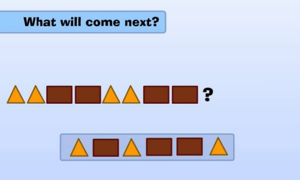

#### Pattern Definition:

  A pattern is the repeated or regular way in which something happens or is done.[1] 
Example: All three attacks followed the same pattern.

 

A simple pattern

 

#### Machine Learning and Pattern Recognition 
  Machine Learning is a field that uses algorithms to learn from data and make predictions. A Machine Learning algorithm then takes these examples and produces a program that does the job. 

  Pattern recognition is the process of recognizing patterns by using a Machine Learning algorithm. Pattern recognition can be defined as the classification of data based on knowledge already gained or on statistical information extracted from patterns and/or their representation.[3]

 

A simple form of Machine Learning

 
#### Types of Machine Learning Algorithms:

+ Supervised Learning
+ Unsupervised Learning
+ Regression
 

Supervised Vs Unsupervised

 
[1] : https://www.collinsdictionary.com/dictionary/english/pattern 
[2] : http://snb.guru/gcse/3_1_1_Representing_algorithms.php 
[3] : https://www.youtube.com/watch?v=hBgkQOa_c1A 
[4] : https://blog.algorithmia.com/introduction-to-unsupervised-learning/

