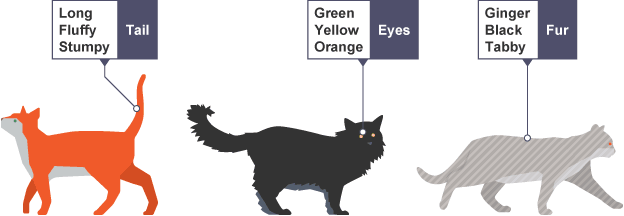

#### Data Definition:
Everything our senses perceive is data, though its storage in our cranial wet stuff leaves something to be desired. Writing it down is a bit more reliable, especially when we write it down on a computer. When those notes are well-organized, we call them data... though I’ve seen some awfully messy electronic scribbles get the same name.[1]

#### Pattern Definition:

  A pattern is the repeated or regular way in which something happens or is done.[2] 
Example: All three attacks followed the same pattern.

 

A simple pattern[3]

 

#### What is Algorithm
An algorithm is a step by step method of solving a problem. It is commonly used for data processing, calculation and other related computer and mathematical operations.
An algorithm is also used to manipulate data in various ways, such as inserting a new data item, searching for a particular item or sorting an item.[4]

#### Machine Learning and Pattern Recognition 
  Machine Learning is a field that uses algorithms to learn from data and make predictions. A Machine Learning algorithm then takes these examples and produces a program that does the job. 

  Pattern recognition is the process of recognizing patterns by using a Machine Learning algorithm. Pattern recognition can be defined as the classification of data based on knowledge already gained or on statistical information extracted from patterns and/or their representation.[5]

 

A simple form of Machine Learning[6]

#### Types of Machine Learning Algorithms:

+ Supervised Learning
+ Unsupervised Learning
+ Regression
 

Supervised Vs Unsupervised[7]

 
[1] : https://towardsdatascience.com/what-is-data-8f94ae3a56b4 
[2] : https://www.collinsdictionary.com/dictionary/english/pattern 
[3] : http://snb.guru/gcse/3_1_1_Representing_algorithms.php 
[4] : https://www.techopedia.com/definition/3739/algorithm 
[5] : https://www.youtube.com/watch?v=hBgkQOa_c1A 
[6] : https://educationalresource.org/content/what-comes-next-pattern 
[7] : https://blog.algorithmia.com/introduction-to-unsupervised-learning/

